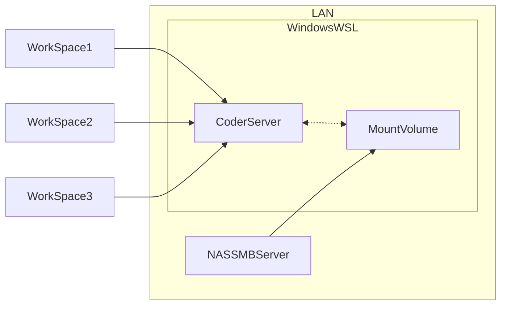

# Dev container for my dev environment

This directory contains the configuration for my dev container. It is based on the Coder self-hosted container. 

The following diagram shows the architecture of the dev container. Since I want to persist my data on my NAS, I have to mount a volume in the container. This volume is mounted from NAS on the CoderServer container. The CoderServercan be userd to host multiple workspaces. 

